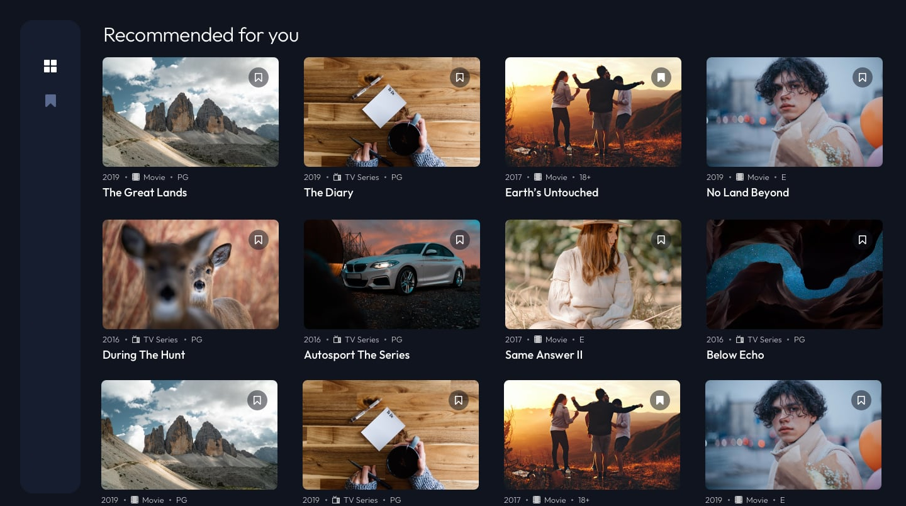
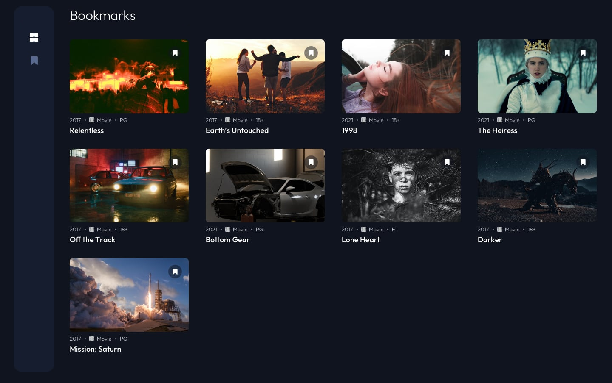

# Fx Watchlist

For this last challenge in our learning TypeScript series, you'll need to create a watchlist for TV Series and Movies using Lightning and TypeScript. 

## Requirements

- The user should be able to add items to their watchlist by pressing enter on any item displayed on the homepage.
- The user should be able to navigate between both the home page and the watchlist page.
- The user should be able to see the items in their watchlist by navigating to the corresponding page.
- The user should be able to remove items from their watchlist by pressing enter on the items in the watchlist.

## Suggestions

- Use Lightning's [UI components](https://rdkcentral.github.io/Lightning-UI-Components/) to speed up development. I mostly recommend using [CardContentVertical](https://rdkcentral.github.io/Lightning-UI-Components/?path=/story/tiles-cards-cardcontentvertical--card-content-vertical) or [Tiles](https://rdkcentral.github.io/Lightning-UI-Components/?path=/story/tiles-cards-tile--tile) for the items, [Plinko rows](https://rdkcentral.github.io/Lightning-UI-Components/?path=/story/navigation-row--plinko) for the layout (or Rows if you struggle with the grid), and a [Column](https://rdkcentral.github.io/Lightning-UI-Components/?path=/story/navigation-column--column) for the navbar.
- Focus on the functionality first. You'll have time to polish the UI later.
- Don't worry about the small bookmark icons on the right side of the items. 

## Designs

You don't need to strictly follow the design. It's there to give you an idea of what the final product should look like.

### Home Page

### Bookmarks Page

## Colors

- Background color: #10141F
- Active item: #FFFFFF
- Inactive item: #5C6B94
- Navbar background: #161D2F